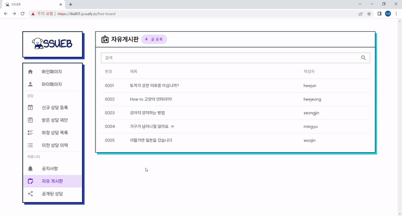

# SSUEB
- 반려동물행동지도사와 반려인 간의 실시간 영상 상담 서비스
- 기간 2023.01.04 ~ 2023.02.16
- 삼성청년SW아카데미 SSAFY 8기 2학기 공통 프로젝트
- 팀 '개발이 힘들면 창밖을 바라보기'
  - 전희준(팀장), 김민규, 서지윤, 엄희정, 이승진, 이우진
- [UCC 소개 영상 보러가기]()

## 목차
1. [기획 배경](#기획-배경)
2. [SSUEB 소개](#SSUEB-소개)
3. [주요 기능](#주요-기능)
4. [주요 기술](#주요-기술)
5. [팀원 역할](#팀원-역할)
6. [프로젝트 구조](#프로젝트-구조)
7. [산출물](#산출물)
8. [서비스 화면](#서비스-화면)

## 기획 배경
최근 반려동물에 대한 관심과 수요가 높아지며, 반려동물 훈련 프로그램이 인기를 끌고 있습니다. 해당 프로그램을 통해 반려인의 양육 방식이 중요하다는 인식이 자리 잡았는데요.

그럼에도 여전히 반려동물 훈육을 어려워하고, 훈육 방법을 모르는 사람들을 위해 SSUEB을 만들었습니다. SSUEB에서는 반려인과 반려동물행동지도사를 매칭해 줘 원격으로 실시간 상담을 진행할 수 있습니다.

## SSUEB 소개
SSUEB은 반려인과 전문가가 실시간 영상 상담을 할 수 있고, 반려동물에 대한 정보를 공유할 수 있는 웹서비스입니다. SSUEB의 상담 예약은 반려인이 상담을 신청하고, 전문가가 반려인의 상담에 대한 제안을 보내면, 반려인이 전문가의 제안을 수락하는 방식으로 진행됩니다.

또한, 상담 예약 외에도 커뮤니티 기능으로 반려동물에 대한 정보를 얻을 수 있습니다. 더불어 전문가, 반려인, 관리자별 페이지가 존재해 사용자의 편리를 고려했습니다.

## 주요 기능
### 상담 예약
- 반려인
  - 반려동물을 등록하고, 등록한 반려동물을 선택해 상담을 신청할 수 있습니다.
  - 전문가가 보낸 상담 제안을 확인하고, 맘에 드는 제안을 선택해 상담을 진행이 가능합니다.
- 전문가
  - 전문가는 반려인이 신청한 상담에 가격과 추가 설명을 작성해 제안을 보낼 수 있습니다.
  - 전문가는 보낸 제안을 삭제할 수 있으며, 반려인이 제안을 수락하면 자동으로 상담이 확정됩니다.

### 화상 상담
- 전문가와 반려인은 예약한 시간에 '화상 미팅룸'에 입장해 실시간 화상 상담을 진행할 수 있습니다.
- 상담 중에 상담 신청 내용을 확인하고, 실시간 채팅을 보낼 수도 있습니다.
- 상담 종료 후, 전문가는 상담 결과를, 반려인은 상담 후기를 작성할 수 있습니다.

### 회원 관리
- 반려인은 자신의 반려동물 정보를 관리할 수 있어요.
- 전문가는 프로필을 등록하고, 지금까지 예약 활동을 그래프로 확인할 수 있어요.
- 관리자는 전문가 가입을 수락하고, 회원을 탈퇴시키거나 알림을 보낼 수 있어요.

### 커뮤니티
- 회원들은 '자유게시판'에 자유롭게 글과 댓글을 쓰고, 좋아요도 누를 수 있습니다.
- 종료된 상담 중 반려인이 공개한 상담은 '공개된 상담'에서 상담 내용을 확인할 수 있습니다.

## 주요 기술
### Backend
-  
-  
-  
-  
- 

### Frontend
-  
-   
- 

### Database
-  

### 배포
-   

### Tools
-  
- 
-  

## 팀원 역할

## 프로젝트 구조
### ERD

### Architecture

## 산출물
- [와이어프레임](https://www.figma.com/file/BWC2t7nooA8dy72KPZ6zmM/SSUEB-wireframe?node-id=3587%3A6008&t=xZ4KPskzLylolxCU-0)
- [기능 명세서](https://mercury-sole-13c.notion.site/1080d58dd9704a06ad11c7ffc42a8545?v=038c79d0537344b0a0c7289e371ca752)
- [요구사항 정의서](https://mercury-sole-13c.notion.site/SSUEB-90fc25b962e340a497efebbd9cd0d91f)
- [DB 설계서](https://mercury-sole-13c.notion.site/SSUEB-DB-8bf5fdd0ceb649e2954e16603b1fafca)
- [API 설계서](https://mercury-sole-13c.notion.site/SSUEB-API-f1bfd30ab2a242a080564266e07a60d8)
- [Convention](https://mercury-sole-13c.notion.site/SSUEB-Team-Convention-d25fc047e14a44ef92b4dfec79707bb9)
- [포딩 매뉴얼](https://tin-preface-7fe.notion.site/1322956a181f47658e11fb7cdbd7b265)

## 서비스 화면
### 반려인
#### 1. 회원가입 진행하기
  
  - 회원가입 시, 휴대폰 인증 진행
  - 아이디 중복 불가능, 모든 정보 유효성 검사 실시
#### 2. 로그인, 마이페이지 이용하기
  
  - 회원정보 수정, 로그아웃, 탈퇴 가능
  - 반려동물 등록, 수정, 삭제 가능
#### 3. 상담 신청하기
  
  - 반려인은 반려동물을 선택해 상담을 신청
#### 4. 전문가의 제안 확인 및 예약 수락하기
  
  - 신청해 둔 상담에 대해 전문가가 보낸 제안을 확인
  - 원하는 전문가를 선택해 제안 수락
#### 5. 전문가와 화상 상담 진행하기
  
  - 실시간 화상 상담 가능
  - 영상 위치 변경, 마이크 끄기, 음성 끄기, 상담 내역 조회 기능 지원
#### 6. 상담 종료 후 리뷰 작성하기
  
  - 상담 종료 후, '이전상담이력'에서 별점, 내용, 상담 공개 여부 수정 가능
  - 공개된 상담은 '공개된 상담'에서 모든 사용자가 조회 가능

### 전문가
#### 1. 회원가입 진행하기
  
  - 회원가입 시, 자격증 번호와 사본 입력
#### 2. 로그인 및 마이페이지 이용하기
  
  - 회원 정보 수정 가능
  - 별점 정보와 상담 활동을 그래프로 확인 가능
- 반려인이 신청한 상담에 제안 전송
#### 3.반려인에게 상담 제안 보내기
  
  - 반려인이 신청해 둔 상담 중 진행 가능한 상담을 선택해 제안 전송
#### 4. 반려인과 화상 상담 진행하기
  
  - 카메라 위치 변경, 오디오 및 카메라 ON&OFF, 상담 정보 조회 가능
  - 상담 종료 후 리뷰 작성 페이지로 이동
#### 5. 상담 결과 작성하기
  
  - 상담 종료 후, '이전상담이력'에서 상담 결과 수정 가능

### 관리자
#### 1. 회원 관리하기
  
  - 로그인 후 전문가 회원가입 수락 가능
  - 회원 탈퇴 처리 가능
  - 원하는 회원에게 문자 또는 이메일로 알림 보내기
#### 2. 커뮤니티 이용하기
  
  - 공지사항 글 등록 가능
  - 자유게시판의 모든 글 및 댓글 삭제 가능

### 커뮤니티
#### 1. 공지사항 보기
  
  - 공지사항 조회 가능
#### 2. 자유게시판 이용하기
  
  - 자유게시판 글 등록, 수정, 삭제 및 댓글 등록, 삭제 가능
  - 전문가는 이름으로, 반려인은 닉네임으로 글 및 댓글 등록
#### 3. 공개된 상담 보기
  
  - 반려인이 리뷰 작성 시, 공개 설정한 상담 조회 가능

### 챗봇
  
  - 로그인 없이도 관리자와 소통 가능한 공간
  - 상주하는 관리자가 즉각 답변
